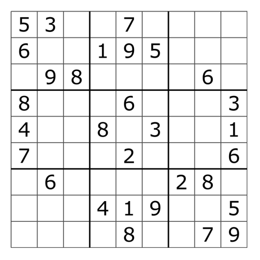
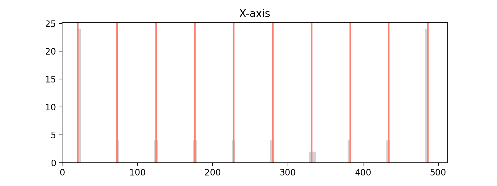

# SudokAI

This app solves Sudoku puzzles using an image as input. 
It uses OpenCV and a neural network to extract the data from the image, and then solves it with a backtrack solver.
The goal of the project was to build it in one day, so there are a lot of improvements to be made!
There is probably a much better method to do this, but I wanted to see what I could come up with myself without spoiling it too much by looking at tutorials or approaches other people used. The main focus of this project was to work with OpenCV.



## Usage

```bash
python main.py --image dataset/10.png
```

Running this command gives the following output:

```txt
534678912
672195348
198342567
859761423
426853791
713924856
961537284
287419635
345286179
```

## Steps

The algorithm uses the following steps to solve the puzzle:

 1. Normalize the image to 512 by 512 pixels.
 2. Detect lines in the image with `cv.HoughLinesP`.
 3. Create a histogram of the x and y points.
 4. Cluster the points to find the 10 points that define the grid (in both directions).
 5. Use the clustered points to generate the lines of the grid.
 6. Extract each individual cell.
 7. Detect if there is something in the cell.
 8. Classify the cell if there is something in it.
 9. Create a Sudoku puzzle.
 10. Solve the puzzle.
 11. Print the solution.

### Detect lines

Detect lines using `cv.HoughLinesP`.


### Clustering

Look at the x values and the y values as a histogram, and cluster the points. The clustering is done by finding the standard deviation of the values on a single axis. The standard deviation is then scaled by a factor `k` (hand picked for good results) to detect if a point is in close proximity to the cluster. The algorithms is as follows: 
 
 1. Sort the values.
 2. Start a cluster with the first point
 3. If the next point is in proximity to the cluster (|x_i - c| < k*std_dev), add it to the cluster.
    1. Re-calculate the center of the cluster, c, which is the mean of the values in the cluster.
    2. If the point is not in proximity then use the cluster mean as the point.
       1. Start a new cluster with the point that was not in proximity, and repeat this.

It work a little bit like a one dimensional k-means clustering (k has nothing to do with the number of clusters though in this case). 
The algorithm can be improved to work with noisier histograms, e.g. if more lines are detected.

I made this video to see if there are any obvious patterns arising when rotating a grid.

https://user-images.githubusercontent.com/2125444/207728663-393470f2-8448-4102-8ed5-10be5b9fa942.mp4


#### X-axis histogram



#### Y-axis histogram


#### Grid defined by cluster means

The cluster means are used to define a grid.


### Extracting cells

Each cell is extracted from the puzzle. In this step the cell is thresholded to black and white, and inverted because that aligns with the training data of the neural network (MNIST dataset).


       

### Classifying digits

Use the neural network to classify the value of the cell.

       

I found it isn't very fond of computer fonts, probably because it is trained on the MNIST data set.

## Neural network

The neural network is an MNIST classifier. I didn't want to spend a lot of time on the neural network part, so I used a tutorial to set it up. It is the hello world of neural networks anyways. 

The network is trained for 8 epochs and has an accuracy of 98%. The weights are included below.

  * [classifier.model](models/classifier.model)

## Improvements

During the development I ran into multiple issues that need to be resolved to allow it to solve a much greater range of input.

 1. Improve extraction:
    1. Remove the border of the cell properly.
    2. Re-center the digit and add padding around it, to better align it for the classifier.
    3. Detect perspective and undo the perspective with a transform.
    4. Improve the extraction of the grid, so it can handle cases where it finds more than 9 clusters on an axis.
 2. Improve classifier:
    1. Currently it uses a MNIST classifier from a tutorial, however it does not handle a computer font really well.
 3. Improve solver:
    1. Current solver only uses backtracking, add forward propagation so it can also be used to find all the solutions.

